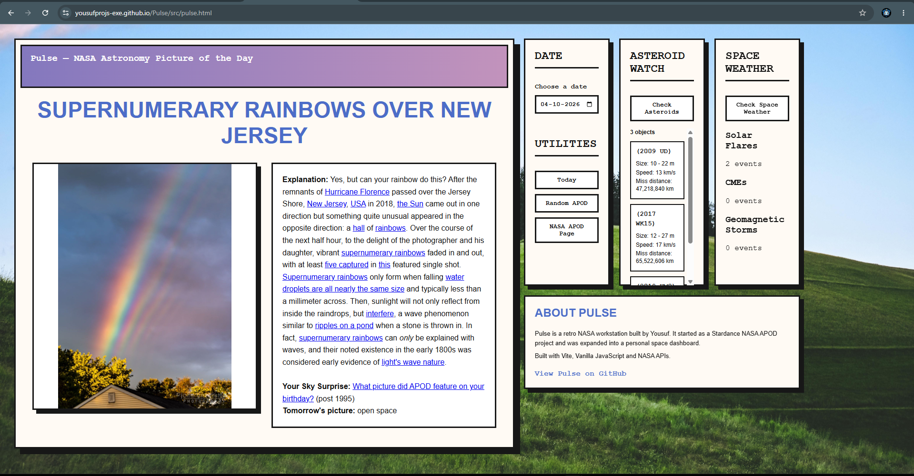

# Pulse - [Try Pulse](https://yousufprojs-exe.github.io/Pulse/)

  

Pulse is a retro NASA workstation-style dashboard built by Yousuf.

It started as a Stardance NASA APOD project and grew into a small space dashboard with multiple NASA data sources, date controls, asteroid tracking, and space weather information.

## What it does

Pulse currently includes:

- NASA Astronomy Picture of the Day
- Date-based APOD browsing
- Random APOD
- Direct link to the NASA APOD page
- Near-Earth asteroid information for a selected date
- Space weather data including solar flares, CMEs, and geomagnetic storms
- A retro workstation-style interface

## Built with

- HTML
- CSS
- Vanilla JavaScript
- Vite

## APIs

Pulse uses NASA and NASA-related data sources:

- NASA APOD
- NASA NeoWs
- NASA DONKI / CCMC

## Deployment

Pulse is deployed using GitHub Pages through GitHub Actions.

The production build is generated with Vite and deployed automatically from the main branch.

## Why I built it

I wanted to make something that felt more like an old NASA workstation than a normal modern dashboard.

The project also gave me a chance to work with real APIs, asynchronous JavaScript, Vite builds, GitHub Actions, and GitHub Pages while keeping the interface completely custom.

## Credits

Built by Yousuf.
another masterpiece,
Started as a Stardance project btw.